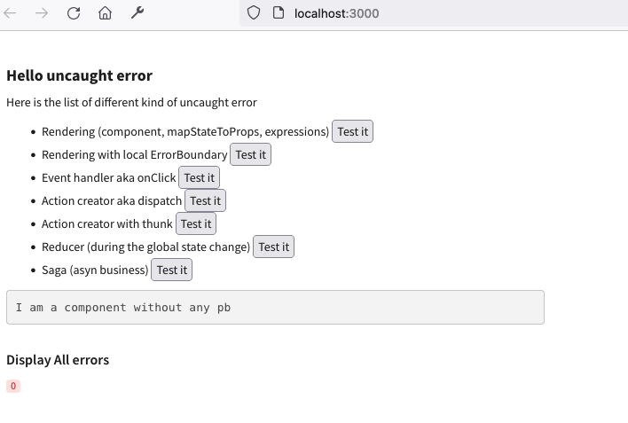

# CMF Error app

This little webapp let us check if @talend/react-cmf is ok on the side of errors managment.

## Render

Error at render make blank screen.
By default CMF render an ErrorBoundary component for that.
Please look at the [official react documentation](https://reactjs.org/docs/error-boundaries.html) for that.

## Redux

By default CMF provide an error middleware so it can report error when something bad happens at middleware level

## Saga

CMF add the option onError at saga level.
